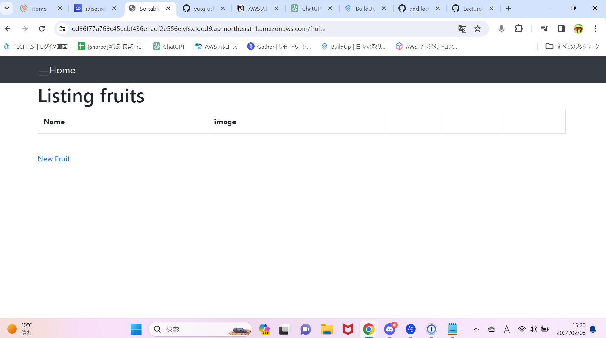
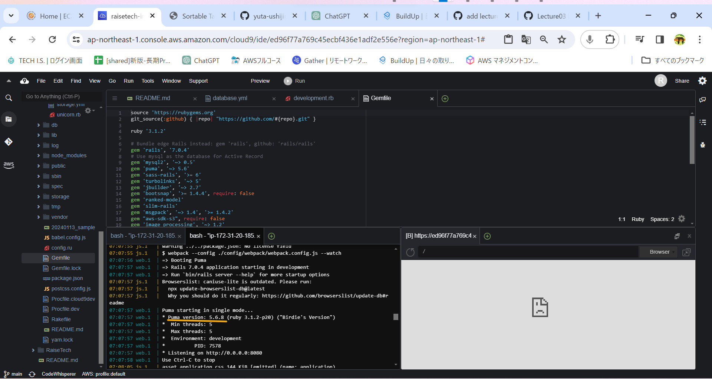
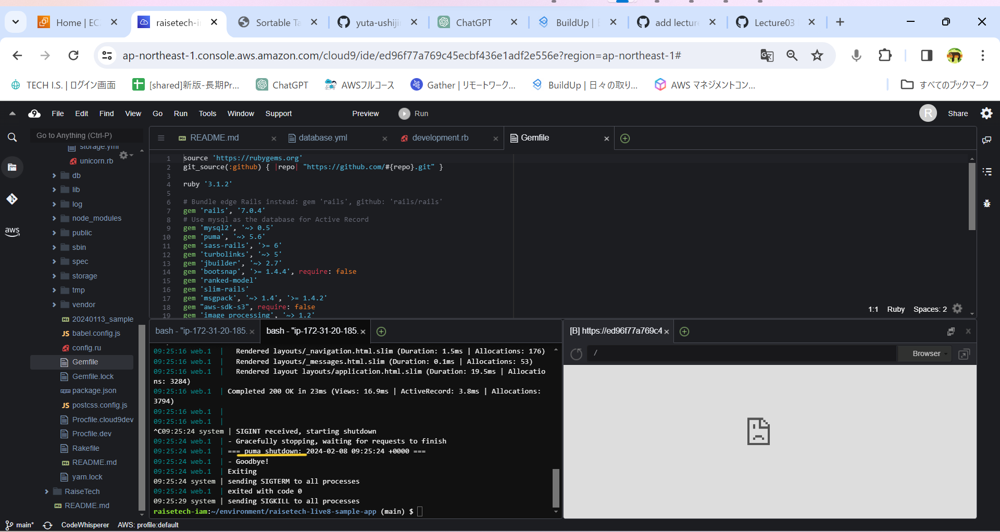
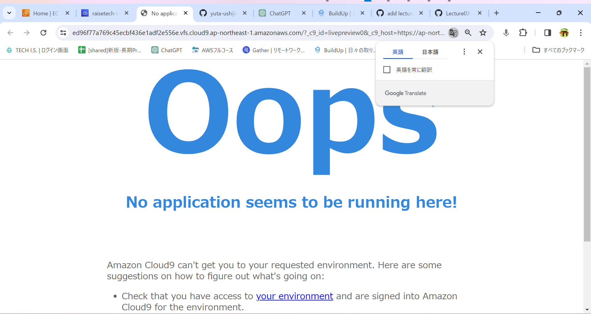
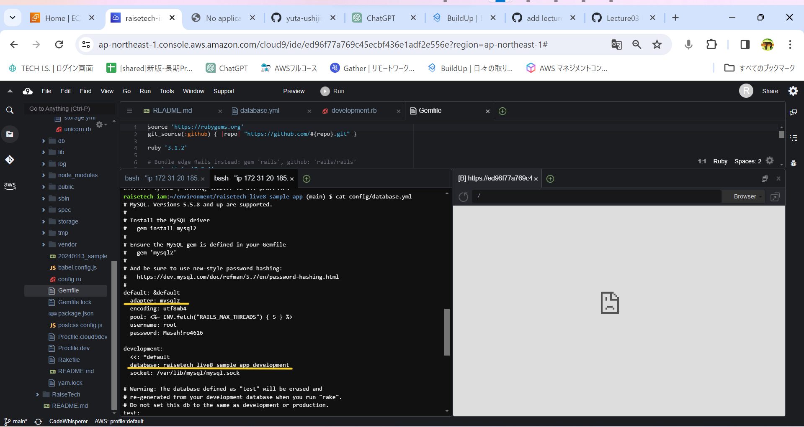
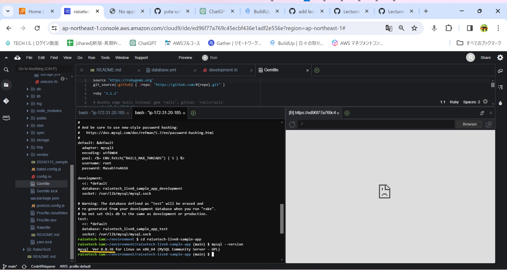
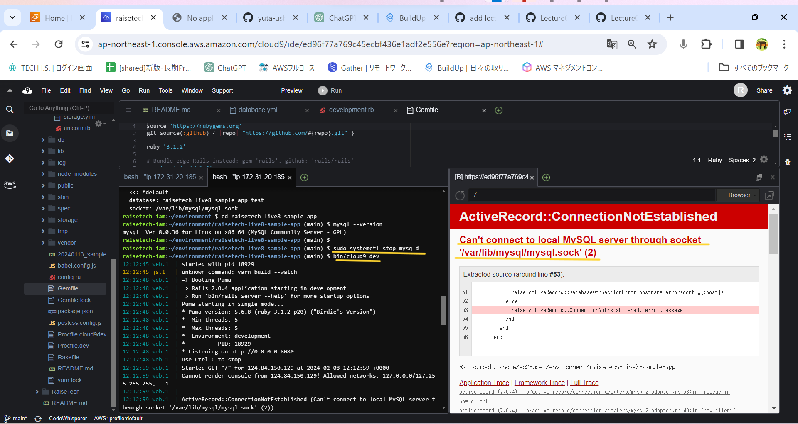
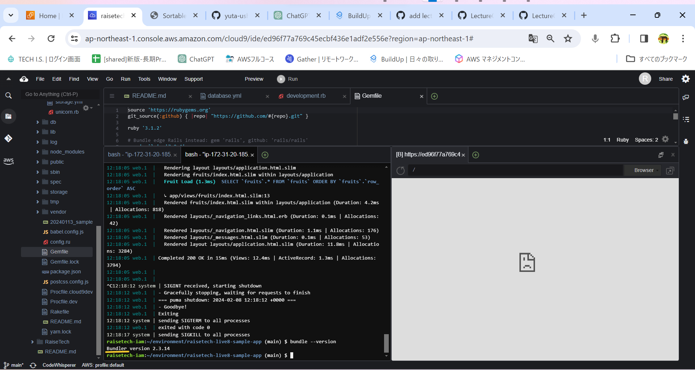

**第３回課題報告**      

- サンプルアプリケーションのデプロイ  

- APサーバーについて１(名称とバージョンの確認)

- APサーバーについて２(サーバー終了時のアクセス状況)

- DBサーバーについて１(サンプルアプリケーションのDB名称とcloud9のバージョン)

- DBサーバーについて２(DB サーバーを終了させた場合、引き続きアクセスできますか？)

- DBサーバーについて３(Rails の構成管理ツールの名前は何でしたか？

- 今回の課題から学んだこと、感じたこと  
　サンプルアプリケーションをデプロイし、実際に触ってみて１つの操作ごとにログが増えていくのを確認しました。
普段何気なく使っているアプリケーションもこのリクエストとレスポンスの繰り返しなんだなと感じました。より理解す
るため参考動画を視聴しておきます。システム開発の流れについては動画の中の座学としては理解しました。ただ、百聞は一見に如かずということわざも
 あるように、実際にその環境に身を置くことができるように頑張って学習していきたいと思います。
 
 
