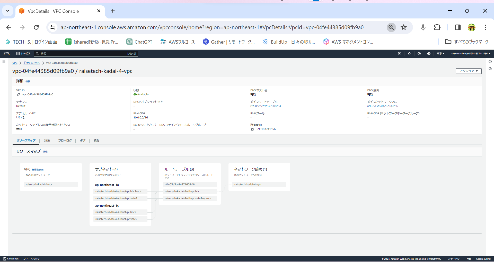
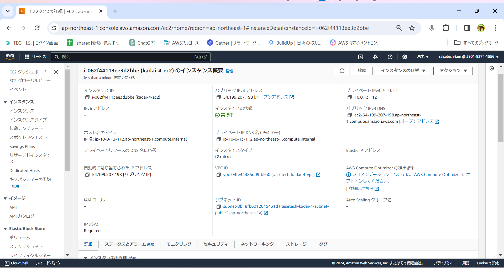
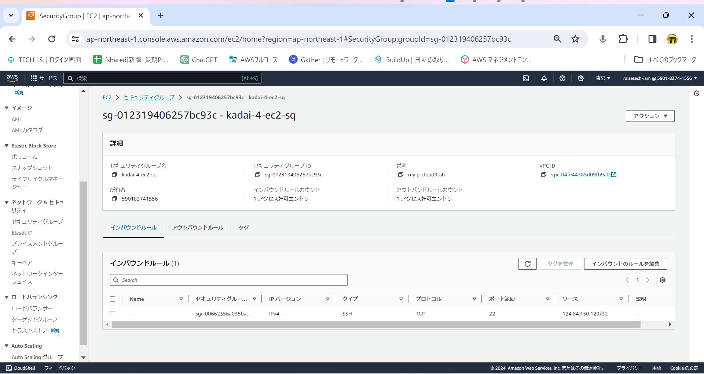
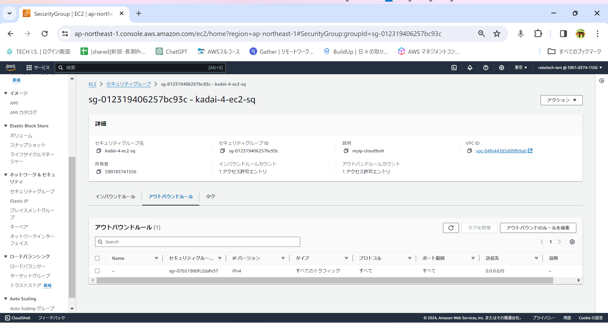
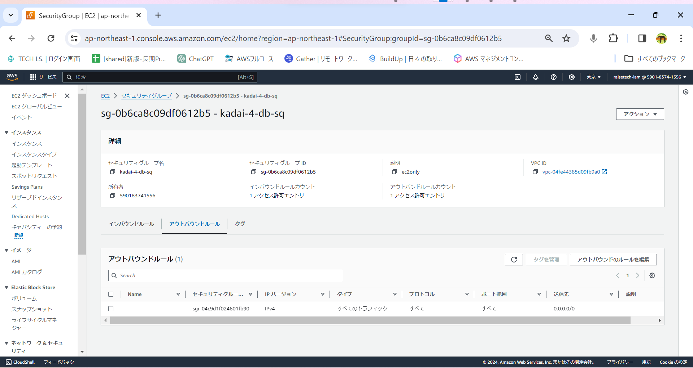

# **第4回課題報告**

**1.VPC新規作成**

**2.EC2構築**

**3.RDS構築**

**4.EC2からRDSへ接続**

**5.感想**
環境構築というものを初めて行いました。講座の中でVPC、EC2，RDSの作り方解説があったのですぐに終わるかなと思って進めましたが、実際にはかなりの時間がかかりました。
間違えて構築してしまい、後から修正しようとしたら変更できず、削除しようとしたら何かと紐ずいていて修正できず・・・といった感じでした。最後接続できた時は何かほっと
したような気持になりました。
またコンピューター、ネットワーク周りの知識に触れてこなかったのでその点でも大変でした。このあたりの知識でつまずいていると今後の課題に大きく影響してくると思います
ので勉強したいと思います。調べたらITパスポートという資格が入門としてあるようなので取得を目指していこうと思います。
