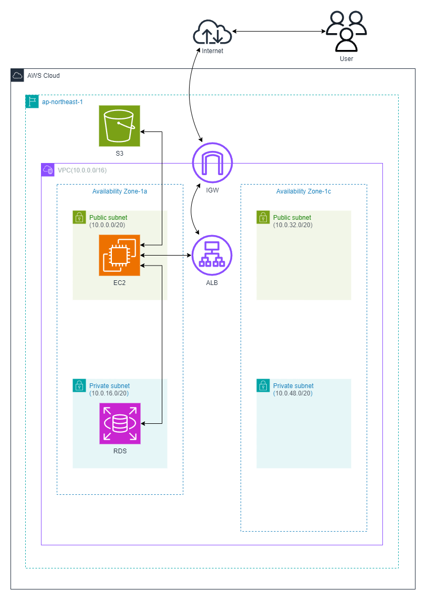

# 第5回課題報告

## 課題内容
1. EC2 上にサンプルアプリケーションをデプロイして、動作確認 
2. ELB(ALB)を追加、動作確認 
3. S3 を追加、動作確認 
4. 環境を構成図に書き起こし  

### 1. EC2 上にサンプルアプリケーションをデプロイして、動作確認
(ⅰ)組み込みサーバーデプロイ 
  
(ⅱ)Nginxの起動 
  
(ⅲ)NginxとUnicornを組み合わせてのRailsアプリケーション動作確認 
  

### 2. ELB(ALB)を追加、動作確認 
(ⅰ)ELB(ALB)を作成 
  
(ⅱ)ELB(ALB)のDNS名で動作確認 
  

### 3. S3を追加、動作確認 
(ⅰ)S3を追加、動作確認 
  

### 4. 環境を構成図に書き起こし 
(ⅰ)構成図 
  

### 5. 感想 
　やっと第5回の課題提出までこぎつけることができました。行った操作はメモしておいたので忘却録として使用したいと思います。最初何をしていいかわからない状態で、とりあえず第3回課題からやり直し始めてから3週間近くたってしまいした。正直最初は課題をこなせる気がしなかったですが、こうして課題提出までこぎつけることができ、少し成長を感じてうれしく思います。
 
　

